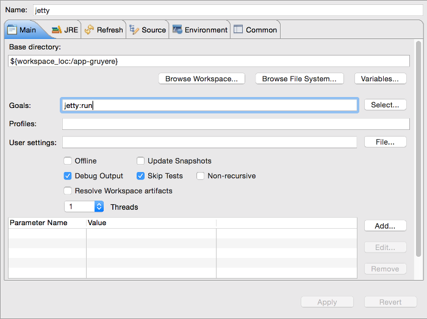
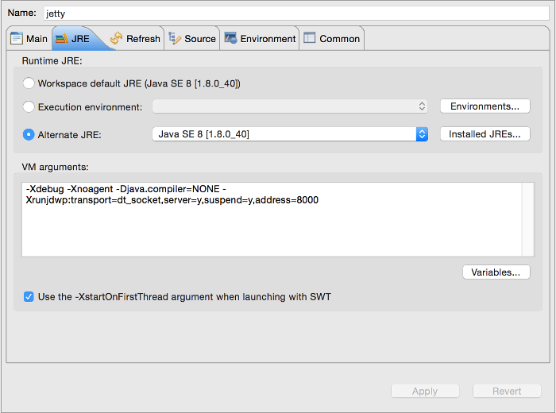
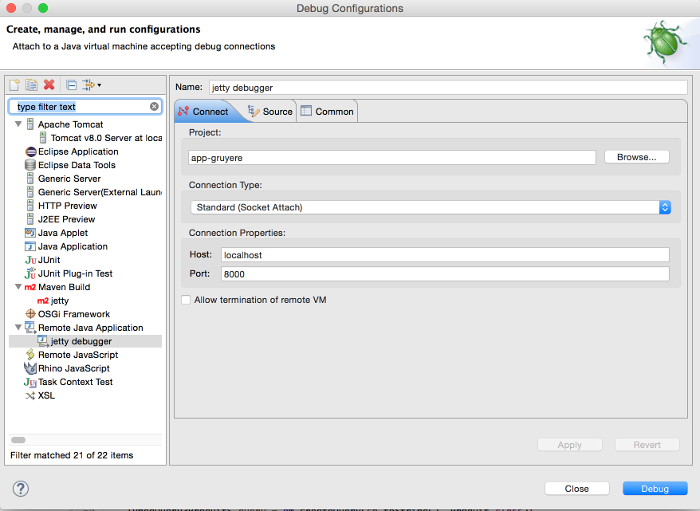

# 

## Installation de l'environnement

### Pré-requis
 * Git
 * JDK 8
 * Eclipse Luna Java EE ou supérieur

### Lancement

**Configuration de run**

**Configuration de debug**

## Deploy to HEROKU

Comme l'application n'est pas à la racine du répository il faut pusher sur Heroku seulement le dossier de l'application.
  
    git subtree push --prefix app-gruyere heroku master
    git subtree push --prefix app-evil heroku-evil master

**Création de l'application Heroku**
  
    cd web-security

    heroku create securite-app-gruyere
    # le repo remote "heroku" est ajouté à git

    heroku create securite-app-evil

    # le repo remote "heroku" existe déjà. Il faut en ajouter un manuellement
    git remote add heroku-evil https://git.heroku.com/securite-app-evil.git

    # Lister les repo remote
    git remote -v